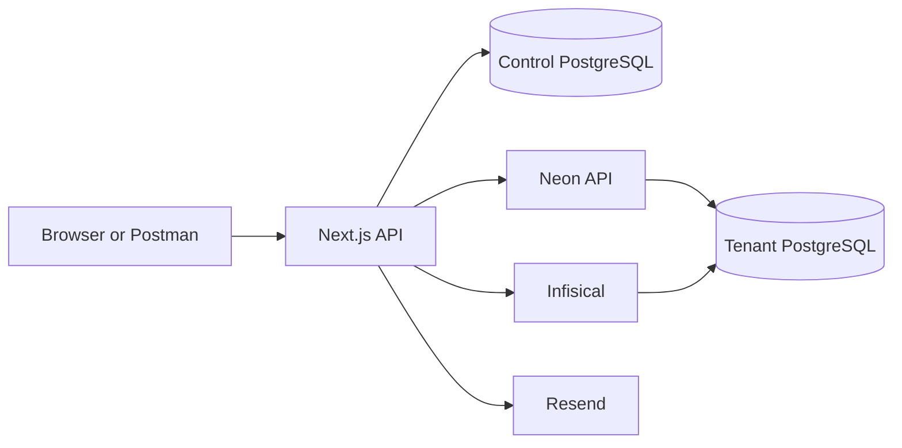

Smart Business

Smart Business is a multi-tenant business operations application built with Next.js, Prisma 7, PostgreSQL, Neon, and Infisical. This document describes the authentication and business onboarding flows that are implemented today. Razorpay test-mode checkout and webhook recording are integrated; final Business/tenant activation after payment is the next workflow step.

## Architecture

- **Control database** stores users, OTP challenges, sessions, businesses, memberships, plans, subscriptions, and tenant lifecycle metadata. Its Prisma schema is in [`prisma/control`](prisma/control).
- **Tenant database** stores operational data for one business. Each tenant gets a Neon project and a tenant-named database; its multi-file Prisma schema is in [`prisma/tenant`](prisma/tenant).
- **Infisical** stores each tenant's database connection URL at `/tenants/<tenantKey>/DATABASE_URL`.
- **Resend** delivers registration verification email.



## Local Setup

Use Node.js 20 or later and pnpm. Configure the required environment variables in the root `.env` file; do not commit real credentials.

| Variable | Purpose |
| --- | --- |
| `CONTROL_DATABASE_URL` | PostgreSQL URL for the control database. |
| `AUTH_JWT_SECRET` | HS256 signing key; must be at least 32 characters. |
| `RESEND_API_KEY` | Resend API credential for OTP email. |
| `RESEND_FROM_EMAIL` | Verified sender address used by Resend. |
| `NEON_API_KEY` | Neon API credential used to create and recover tenant projects. |
| `NEON_ORG_ID` | Neon organization that owns tenant projects. |
| `INFISICAL_SITE_URL` | Infisical base URL, for example `https://app.infisical.com`. |
| `INFISICAL_PROJECT_ID` | Infisical project in which tenant database secrets are stored. |
| `INFISICAL_ENVIRONMENT` | Infisical environment; defaults to `production` if omitted. Set to `dev` for local development when that is the intended environment. |
| `INFISICAL_CLIENT_ID` | Universal Auth machine identity client ID. |
| `INFISICAL_CLIENT_SECRET` | Universal Auth machine identity client secret. |
| `SECRET_PROVIDER` | Set to `infisical` so tenant clients retrieve URLs from Infisical. The code defaults to `env`. |
| `RAZORPAY_KEY_ID` | Razorpay Test Mode public key ID used by Checkout. |
| `RAZORPAY_KEY_SECRET` | Razorpay Test Mode server secret used to create Orders. |
| `RAZORPAY_WEBHOOK_SECRET` | Secret configured for the Razorpay webhook endpoint. |

The Infisical machine identity must belong to the configured project and have permission to read, create, and update secrets, as well as create the required folders in the configured environment. Folder creation uses `/tenants` and `/tenants/<tenantKey>`.

Initialize the control database and seed its required Owner role and Starter plan:

```bash
pnpm install
pnpm run generate:controlDB
pnpm run migrate:controlDB
pnpm run seed:control
pnpm run generate:tenantDB
pnpm dev
```

The tenant database migrations are applied automatically during tenant provisioning with `prisma migrate deploy`; they are not applied to the control database. Useful additional commands:

```bash
pnpm lint
pnpm build
pnpm run migrate:tenantDB
```

`pnpm run reset:controlDB` is destructive: it drops control database data and reapplies its migrations. Do not use it against a database whose data must be kept.

## Authentication

Registration currently uses email and password. Phone OTP is not exposed by the registration API.

### Register and Verify Email

1. Start registration with `POST /api/auth/register/start`:

	 ```json
	 {
		 "email": "owner@example.com",
		 "password": "a-long-password"
	 }
	 ```

	 Email is trimmed and lowercased. Password length must be 8-128 characters. The user is created as unverified, a six-digit OTP challenge is stored as a hash, and Resend sends the code. A challenge expires after 10 minutes. Resend requests have a 60-second cooldown.

	 Successful response (`200`):

	 ```json
	 {
		 "success": true,
		 "data": {
			 "challengeId": "<challenge-id>",
			 "expiresAt": "<timestamp>"
		 }
	 }
	 ```

2. Verify the OTP with `POST /api/auth/register/verify`:

	 ```json
	 {
		 "challengeId": "<challenge-id>",
		 "code": "123456"
	 }
	 ```

	 The OTP can be attempted at most five times. Success marks the email verified and creates a session. The response sets the access and refresh cookies; the code is not returned by the API.

Authentication errors use a `{ "success": false, "error": { "code", "message" } }` response except where noted. Common outcomes are:

| Endpoint | Status | Examples |
| --- | ---: | --- |
| `POST /api/auth/register/start` | `400`, `409`, `429`, `503` | Invalid input, existing account, resend cooldown, or email delivery failure. |
| `POST /api/auth/register/verify` | `400`, `429` | Invalid/expired challenge or OTP; `OTP_MAX_ATTEMPTS` returns `429`. |
| `POST /api/auth/login` | `401`, `403` | Invalid credentials; unverified, inactive, or otherwise blocked account. |
| `POST /api/auth/refresh` | `401` | Missing, invalid, revoked, or expired refresh token. |
| `GET /api/auth/me` | `401`, `403`, `404` | Missing/invalid session, inactive user, or missing user record. |

### Login

Send `POST /api/auth/login` with:

```json
{
	"email": "owner@example.com",
	"password": "a-long-password"
}
```

Login requires an active, email-verified user and valid password. Unknown email and incorrect password share the same `INVALID_CREDENTIALS` response to avoid disclosing whether an account exists. Success sets both session cookies.

Passwords are stored as salted scrypt hashes. Access tokens are signed JWTs using HS256; the server also checks their persisted session before treating a request as authenticated.

### Session Cookies and Endpoints

| Endpoint | Purpose |
| --- | --- |
| `GET /api/auth/me` | Return the current user and active session. |
| `POST /api/auth/refresh` | Validate and rotate the refresh token; returns new access and refresh cookies. |
| `POST /api/auth/logout` | Revoke the refresh-token session and expire both cookies. |

Cookies are `HttpOnly`, `SameSite=Lax`, and `Secure` in production. The access cookie is valid for 15 minutes and applies to `/`. The refresh cookie is valid for 30 days and is scoped to `/api/auth`. Refresh tokens are stored as hashes in the control database and rotated on refresh. For browser or Postman testing, keep the cookie jar enabled between requests.

## Business Onboarding

Create a business with `POST /api/businesses`. It requires an authenticated access cookie.

```json
{
	"name": "Smoke Test Cafe",
	"slug": "smoke-test-cafe",
	"businessType": "RESTAURANT",
	"legalName": "Smoke Test Foods Private Limited",
	"gstin": "27ABCDE1234F1Z5",
	"firstLocation": {
		"name": "Smoke Test Cafe Andheri",
		"slug": "smoke-test-cafe-andheri",
		"operatingMode": "DINE_IN",
		"addressLine1": "12 Example Road",
		"addressLine2": "Shop 4",
		"city": "Mumbai",
		"state": "Maharashtra",
		"postalCode": "400001",
		"phone": "+912200000000"
	}
}
```

`businessType` accepts `CAFE`, `RESTAURANT`, `QSR`, `CLOUD_KITCHEN`, `BAKERY`, `FOOD_TRUCK`, or `OTHER`. `legalName` and `gstin` are optional. The first outlet name, slug, operating mode, street address, city, state, and six-digit Indian PIN are required; second address line and phone are optional. GSTIN is normalized to uppercase and format-validated when supplied.

### Provisioning Sequence

Business creation first commits a control-database transaction:

1. Validate that the authenticated user exists.
2. Resolve the seeded system `owner` role and active `starter` plan.
3. Create the Business and an active Owner membership for the current user.
4. Create a `TRIAL` subscription and a `CREATED` subscription event. This does not charge the user or contact a payment provider.
5. Save the legal/business classification fields and first-outlet setup in the Control DB. The saved outlet profile allows provisioning retries to continue with the same details.
6. Create a `TenantDatabase` lifecycle row in `PROVISIONING` state with a tenant key in the form `tenant-<businessId>`.

After that transaction commits, external provisioning runs:

1. Create or recover the tenant's Neon project and resolve its default branch.
2. Ensure the tenant-named PostgreSQL database exists in that project.
3. Persist Neon project, branch, host, and database metadata in the control database so a retry can recover the resource.
4. Run the tenant Prisma migrations from `prisma/tenant/migrations` against that database.
5. Store or update the database URL in Infisical at `/tenants/<tenantKey>/DATABASE_URL`.
6. Verify connectivity with a tenant database health check.
7. Mark the tenant database `ACTIVE` and record schema version and provisioning timestamps.
8. Create the initial Location in the tenant database using the saved outlet details. This operation is idempotent by outlet slug.

The successful response is `201` and includes the business, tenant, subscription, initial location, and `onboarding.status: "COMPLETED"`.

The seeded plans are Starter (`maxLocations=1`, `maxReviewCards=3`), Growth (`maxLocations=5`, billed per location), and Enterprise (unlimited locations, starting-at price per location). Starter and Growth include monthly and annual prices; Enterprise currently has a monthly starting price. Prices are stored in INR minor units and are exclusive of GST. New onboarding drafts select a quoted plan price before checkout; no Business or tenant is created until the later payment-finalization workflow.

### Razorpay Test Checkout

The draft flow currently exposes:

| Endpoint | Purpose |
| --- | --- |
| `GET /api/plans` | Return active plans, prices, and entitlements. |
| `POST /api/onboarding/drafts` | Save authenticated business and first-outlet details. |
| `GET /api/onboarding/drafts/<draftId>` | Resume an owner’s draft. |
| `PATCH /api/onboarding/drafts/<draftId>` | Select and snapshot an active plan price. |
| `POST /api/onboarding/drafts/<draftId>/checkout` | Create or reuse a Razorpay Test Mode Order. |
| `POST /api/webhooks/razorpay` | Verify and idempotently process Razorpay events. |

The checkout endpoint calculates the amount from the selected Control DB `PlanPrice`; clients cannot submit an amount. The webhook verifies the raw request body with `RAZORPAY_WEBHOOK_SECRET` and the `X-Razorpay-Signature` header, deduplicates using `x-razorpay-event-id`, and moves the draft to `PAID` only for captured payment events. A browser callback is not treated as payment confirmation. Configure Razorpay in Test Mode and expose the webhook endpoint through a public HTTPS staging URL; localhost cannot receive Razorpay webhooks directly.

### Provisioning Failures and Retry

Provisioning uses a lease in the control database to prevent concurrent workers from changing the same tenant. The lease lasts five minutes and renews every minute. A completed tenant is `ACTIVE`; a failed external step is recorded as `FAILED` with the failing stage and sanitized error details in `lastProvisioningError` and server logs.

For a tenant in `FAILED` state, an authenticated active business Owner can retry with:

```http
POST /api/businesses/<businessId>/provision
```

No request body is required. Retry recovers the existing Neon project/database, re-applies pending migrations, updates the Infisical secret, verifies the database, and attempts initial Location creation. A concurrent retry returns `409`. A successful retry returns `200`.

Current response behavior:

| Result | Status | Code |
| --- | ---: | --- |
| Business and tenant onboarding completed | `201` on create, `200` on retry | `onboarding: COMPLETED` |
| Tenant provisioning failed but failure state is persisted | `202` | `TENANT_PROVISIONING_FAILED` |
| Retry already in progress or tenant not retryable | `409` | `TENANT_PROVISIONING_CONFLICT` or `TENANT_NOT_RETRYABLE` |
| Provisioning state cannot be verified | `503` | `TENANT_PROVISIONING_STATE_UNKNOWN` |
| Initial Location failed after tenant activation | `202` | `INITIAL_LOCATION_CREATION_FAILED` |

The retry endpoint currently accepts only `FAILED` tenant rows. If the tenant is already `ACTIVE` but initial Location creation failed, that specific recovery path needs a separate onboarding-resume operation.

## Data and Secret Boundaries

- User credentials, verification challenges, auth sessions, business records, memberships, subscriptions, and tenant lifecycle state live in the control database.
- Restaurant/tenant operational records such as Locations, menus, orders, and tables live in the tenant database.
- Tenant clients resolve the active tenant from the control database, fetch the connection URL through the configured secret provider, then construct a tenant Prisma client.
- The control and tenant Prisma schemas have separate configs: `prisma/control.config.ts` and `prisma/tenant.config.ts`.
- Never return database URLs or machine identity credentials from API responses. Keep `.env` out of version control and rotate credentials if they are exposed.

## Payment Integration Roadmap

The control schema already has early commerce structures (`PurchaseOrder`, `Payment`, `Refund`, and `Invoice`) and subscription lifecycle statuses/events. Razorpay Order creation and webhook recording now exist for onboarding, but payment-driven Business activation, subscription creation, and tenant provisioning after `PAID` are still intentionally separate.

Suggested implementation order:

1. **Define billing behavior.** Decide which plans are free trials versus paid, supported currencies, billing periods, tax treatment, trial duration, and what happens when payment fails. The current Starter plan and entitlements are seeded in `scripts/seed-control.ts`.
2. **Add provider mappings.** Choose a provider (the schema already lists Razorpay as an option), store provider customer/subscription identifiers, and map local plans/prices to provider price IDs. Keep all money amounts in integer minor units, as the commerce models do now.
3. **Razorpay checkout and webhook recording.** Implemented for Test Mode: the server creates Orders from the quoted Control DB price, and the webhook verifies the raw-body signature, deduplicates events, and marks drafts paid.
4. **Finalize after payment.** Create the Business, owner membership, subscription, onboarding profile, and tenant lifecycle record transactionally after `PAID`; then provision Neon asynchronously. Do not activate based only on a browser callback.
5. **Connect payment state to entitlements.** Define when a subscription becomes `ACTIVE`, `PAST_DUE`, `CANCELED`, or `EXPIRED`; make access checks enforce those states and plan entitlements. Decide explicitly whether tenant provisioning starts after payment or during a trial.
6. **Handle lifecycle and failures.** Implement renewals, failed-payment retries/dunning, cancellation at period end, plan changes/proration, refunds, invoice issuance, and idempotent webhook replay. Keep tenant provisioning retries independent from payment retries so a paid business can recover infrastructure without paying twice.
7. **Test in provider sandbox.** Cover success, decline, duplicate/out-of-order webhooks, timeouts, webhook signature failures, retries, cancellation, refunds, and provisioning failure after confirmed payment before enabling live credentials.

Keep provider secrets in environment/secret management, verify webhook signatures, and avoid logging full payment payloads or sensitive customer data.
First, run the development server:

```bash
npm run dev
# or
yarn dev
# or
pnpm dev
# or
bun dev
```

Open [http://localhost:3000](http://localhost:3000) with your browser to see the result.

You can start editing the page by modifying `app/page.tsx`. The page auto-updates as you edit the file.

This project uses [`next/font`](https://nextjs.org/docs/app/building-your-application/optimizing/fonts) to automatically optimize and load [Geist](https://vercel.com/font), a new font family for Vercel.

## Learn More

To learn more about Next.js, take a look at the following resources:

- [Next.js Documentation](https://nextjs.org/docs) - learn about Next.js features and API.
- [Learn Next.js](https://nextjs.org/learn) - an interactive Next.js tutorial.

You can check out [the Next.js GitHub repository](https://github.com/vercel/next.js) - your feedback and contributions are welcome!

## Deploy on Vercel

The easiest way to deploy your Next.js app is to use the [Vercel Platform](https://vercel.com/new?utm_medium=default-template&filter=next.js&utm_source=create-next-app&utm_campaign=create-next-app-readme) from the creators of Next.js.

Check out our [Next.js deployment documentation](https://nextjs.org/docs/app/building-your-application/deploying) for more details.
